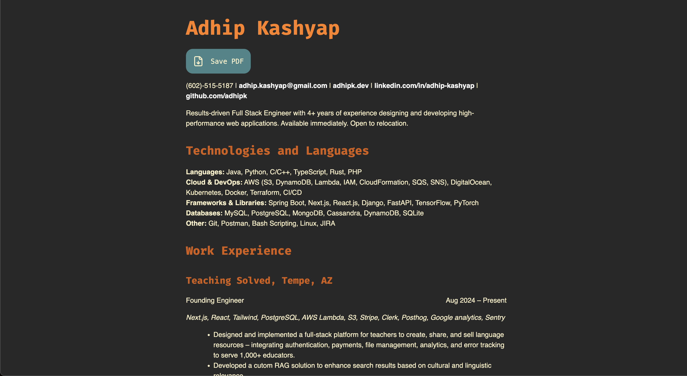

# Resume Reloaded

A modern, professional resume generator that converts markdown into beautifully formatted PDF and HTML versions. Create both an interactive web version and a traditional PDF resume from a single markdown source.


## Features

- Single source of truth: Maintain one markdown file for all resume formats
- Multiple output formats: Generate PDF and HTML versions
- Customizable styling: Separate CSS files for web and print versions
- Interactive web version: Allows you to have interactive elements on the web version while hiding it on the PDF version.
- Responsive design: Looks great on all devices
- Smart Printing: Printing automatically uses the PDF version.

## Prerequisites

- [Pandoc](https://pandoc.org/installing.html) - Universal document converter
- [WeasyPrint](https://doc.courtbouillon.org/weasyprint/stable/first_steps.html) - HTML to PDF converter

## Project Structure

```
.
├── resume.md          # Your resume content in markdown
├── style.css         # CSS for PDF output
├── screen.css        # CSS for web output
├── build.sh          # Build script for generating outputs
└── demo/             # Example outputs and screenshots
```

## Getting Started

1. Clone this repository
2. Install the prerequisites
3. Edit `resume.md` with your information
4. Customize styles in `style.css` (PDF) and `screen.css` (web)

## Usage

Generate your resume using the build script:

```bash
# Generate HTML version (web)
./build.sh resume html

# Generate PDF version
./build.sh resume pdf
```

### Customization

- **Content**: Edit `resume.md` using markdown syntax
- **PDF Styling**: Modify `style.css` for the PDF output
- **Web Styling**: Adjust `screen.css` for the web version

### Markdown Format

Your resume markdown should include:

```markdown
---
title: Your Name
lang: en-US
description: Your professional summary
---

# Your Name
Contact details...

## Experience
Your work history...
```

## Examples

Check out the demo directory for sample outputs:
Web View:

PDF View:


## License

MIT
